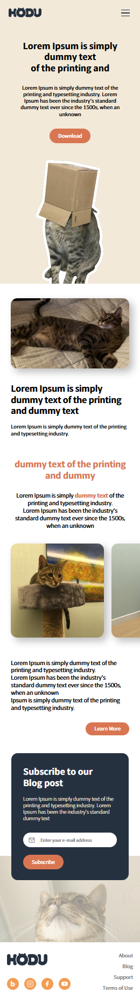

# HODU 랜딩 페이지

> 귀여운 호두의 정보가 담겨있는 랜딩 페이지<br />
> 🔗 URL : [HODU 랜딩 페이지](https://silverstar9482.github.io/HODU-page/)

## 📚 목차

-   [📝 프로젝트 소개](#-프로젝트-소개)
-   [🛠️ 사용 기술](#️-사용-기술)
-   [✨ 주요 구현 요소](#-주요-구현-요소)
-   [🗓️ 개발 기간](#️-개발-기간)
-   [📁 폴더 구조](#-폴더-구조)
-   [📸 스크린샷](#-스크린샷)
-   [🔎 향후 진행 계획](#-향후-진행-계획)
-   [🙋‍♂️ Developer](#️-developer)

## 📝 프로젝트 소개

-   이 프로젝트는 귀여운 호두의 정보가 담겨있는 랜딩 페이지를 클론코딩 하여 제작하는 프로젝트 입니다.
-   미디어 쿼리를 사용하여 반응형 레이아웃으로 만들어 사용자에게 일관된 경험을 주고 유효성 검사를 통해 웹접근성을 표준을 준수하고 SEO 최적화를 통해 웹페이지를 크롤링했을 때 검색 결과 최상위에 노출될 가능성을 높였습니다.
-   추후 JavaScript를 통해 button 클릭 시 Modal창 노출 기능을 추가 할 예정입니다.

## 🛠️ 사용 기술

-   HTML
-   CSS3

## ✨ 주요 구현 요소

-   시맨틱 마크업: header, main, section, footer 등 HTML5 시멘틱 태그를 적극 활용하여 구조적이고 의미 있는 문서 구성.
-   반응형 레이아웃: 미디어 쿼리를 사용해 다양한 화면 크기(모바일, PC)에 맞춰 콘텐츠가 유동적으로 배치되도록 구현.
-   접근성 향상: 시각장애인을 위한 적절한 마크업 고려.
-   기본적인 SEO 최적화: title, meta, h1 태그를 활용한 검색엔진 친화적 구조 설계.

## 🗓️ 개발 기간

-   2025.06.19 - 2025.06.20

## 📁 폴더 구조

```
📦HODU-page
 ├ 📂css
 │ ├ 📜reset.css
 │ └ 📜style.css
 ├ 📂image
 ├ 📜index.html
 └ 📜README.md
```

## 📸 스크린샷

### 🖥️ PC

<!--  -->

### 📱 Mobile



## 🔎 프로젝트 추후 진행 계획

-   JavaScript로 button 클릭 시 Modal창 노출 구현

## 🙋‍♂️ Developer

-   **개발자** : 조은별
-   **📌 GitHub** : https://github.com/silverstar9482
